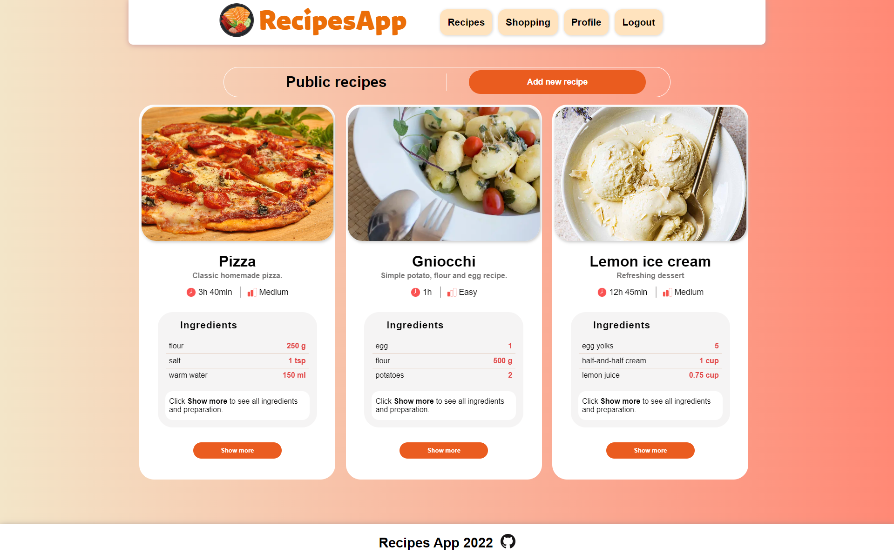

# Recipes App

This application is for browsing and creating your own recipes. It also allowes you to create a shopping list. There is also a possibility to add chosen ingredients from recipes to shopping list.
The app is created with React v18.2 and it includes only frontend, for basic backend and database purposes the Realtime Database is being used.

Completed features: 
- Allow user to create new account and login with Firebase Authentication - validation and error handling included,
- Allow user to browse the recipes and add ingredients from specific recipe to shopping list,
- Allow user to add and delete products from shopping list,
- The application is made with RWD (responsive web design). 

TODO features:
- Allow user to create his own shopping list and maybe share it with other users,
- Allow user to edit the products on the shopping list (?),
- Allow user to create, edit and delete his own recipe,
- Allow user to change the password or the user data in the Profile section,
- Password reminder,
- Add auto logout after certain time.

Future possible features:
- Create the possibility of purchase chosen recipes or products (on a delivery company basis),
- Expand the user profile with more information,
- Add Redux when it will be needed.

## Available Scripts

In the project directory, you can run:

### `npm start`

Runs the app in the development mode.\
Open [http://localhost:3000](http://localhost:3000) to view it in your browser.

The page will reload when you make changes.\
You may also see any lint errors in the console.

### `npm test`

Launches the test runner in the interactive watch mode.\
See the section about [running tests](https://facebook.github.io/create-react-app/docs/running-tests) for more information.

### `npm run build`

Builds the app for production to the `build` folder.\
It correctly bundles React in production mode and optimizes the build for the best performance.

The build is minified and the filenames include the hashes.\
Your app is ready to be deployed!

See the section about [deployment](https://facebook.github.io/create-react-app/docs/deployment) for more information.

